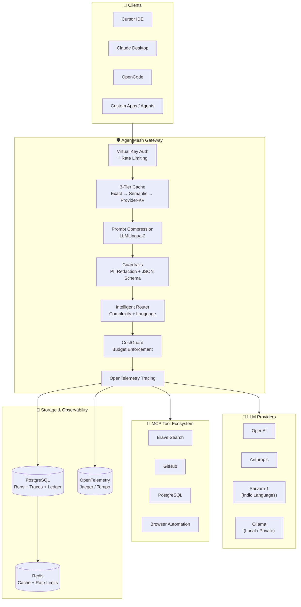

<p align="center">
  
  
  
  
  
</p>

<h1 align="center">AgentMesh — AI Agent Control Plane</h1>

<p align="center">
  <b>One endpoint. Every model. Every rupee tracked.</b><br/>
  A production-grade LLM gateway with semantic caching, MCP orchestration, real-time cost intelligence, and agent execution tracing.
</p>

<p align="center">
  <a href="#-live-demo">🌐 Live Demo</a> •
  <a href="#-architecture">🏗️ Architecture</a> •
  <a href="#-features">✨ Features</a> •
  <a href="#-quick-start">🚀 Quick Start</a> •
  <a href="#-api-reference">📡 API</a>
</p>

---

##  Live Demo

**Deployed URL:** `https://agentmesh-demo.onrender.com`

| Endpoint | Description |
|----------|-------------|
| `/dashboard` | Real-time cost analytics, agent traces, MCP health |
| `/docs` | Interactive OpenAPI/Swagger documentation |
| `/health` | Service health + dependency status |

---

##  Architecture



---

##  Features

###  Unified API Surface
| Protocol | Endpoints | Supported By |
|----------|-----------|--------------|
| OpenAI-compatible | `/v1/chat/completions`, `/v1/models`, `/v1/embeddings` | Cursor, OpenCode, Kiro |
| Anthropic-compatible | `/v1/messages`, `/v1/models` | Claude Desktop |
| MCP Gateway | `/v1/mcp/registry`, `/v1/mcp/invoke`, `/v1/mcp/health` | Any MCP client |

###  Intelligent Routing
- **Language-aware:** Hindi / Marathi / Tamil / Telugu → auto-routes to **Sarvam-1**
- **Complexity-aware:** Simple queries → cheaper models. Hard reasoning → GPT-4o / Claude
- **Fallback chain:** OpenAI → Anthropic → Sarvam → Ollama (with circuit breaker)

###  Cost Intelligence
- **Per-run cost tracing:** Every LLM call + MCP tool call tracked with INR pricing
- **Budget enforcement:** Monthly caps per virtual key. Auto-downgrade at 80%. Hard block at 100%.
- **Savings engine:** Semantic cache + prompt compression + smart routing = **up to 63% cost reduction**

###  Production Guardrails
| Guard | What It Does |
|-------|-------------|
| **PII Redaction** | Masks Aadhaar, PAN, phone, email, credit cards before leaving the network |
| **JSON Schema Enforcement** | Validates structured output at the gateway layer (422 on violation) |
| **Rate Limiting** | Token-bucket per virtual key via Redis |
| **Budget Alerts** | Threshold alerts at 50% / 80% / 95% |

###  Dashboard & Observability
- **Agent Run Timeline:** Gantt-style trace of every step (LLM + MCP) with latency and cost
- **Cost Breakdown:** Per model / per agent / per MCP tool / per time period
- **Cache Analytics:** Hit rate, savings, compression ratio
- **MCP Health:** Catalog of registered servers with uptime and latency

---

##  Quick Start

### Option A: Local Development (₹0, Zero API Keys)
Uses **Ollama** as the default provider — test the full pipeline without spending a rupee.

```bash
git clone https://github.com/Apoorva5544/Agentmesh.git && cd Agentmesh
cp .env.example .env
docker compose up -d

# Pull a local model
docker compose exec ollama ollama pull qwen2:7b

# Test it
curl http://localhost:8000/v1/chat/completions   -H "Content-Type: application/json"   -d '{"model":"ollama/qwen2:7b","messages":[{"role":"user","content":"Hello"}]}'
```

### Option B: Cloud Deploy (Production Quality)
```bash
# Requires: OPENAI_API_KEY, ANTHROPIC_API_KEY, SARVAM_API_KEY
docker compose up -d api postgres redis
```

### Environment Variables
| Variable | Required | Description |
|----------|----------|-------------|
| `DATABASE_URL` | ✅ | PostgreSQL connection string |
| `REDIS_URL` | ✅ | Redis connection string |
| `OPENAI_API_KEY` | ❌ | OpenAI API key |
| `ANTHROPIC_API_KEY` | ❌ | Anthropic API key |
| `SARVAM_API_KEY` | ❌ | Sarvam-1 API key (Indic languages) |
| `ADMIN_API_KEY` | ✅ | Master key for virtual key management |
| `ALLOW_NO_AUTH` | ✅ | `false` in production |
| `OTEL_ENABLED` | ❌ | Enable OpenTelemetry tracing |

---

##  API Reference

### Chat Completions
```bash
curl -X POST https://agentmesh-demo.fly.dev/v1/chat/completions   -H "Authorization: Bearer am-vk-xxx"   -H "Content-Type: application/json"   -d '{
    "model": "auto",
    "messages": [{"role": "user", "content": "नमस्ते"}],
    "stream": true
  }'
```

### MCP Tool Invocation
```bash
curl -X POST https://agentmesh-demo.fly.dev/v1/mcp/invoke   -H "Authorization: Bearer am-vk-xxx"   -d '{
    "server": "brave_search",
    "tool": "web_search",
    "arguments": {"query": "latest AI funding India 2026"}
  }'
```

### Agent Run with Tracing
```bash
curl -X POST https://agentmesh-demo.fly.dev/v1/agents/support-bot/run   -H "Authorization: Bearer am-vk-xxx"   -d '{
    "steps": [
      {"type": "llm", "prompt": "Summarize this ticket"},
      {"type": "mcp", "server": "postgres", "tool": "query", "args": {"sql": "SELECT * FROM tickets WHERE id = 1"}}
    ]
  }'
```

---

##  Benchmarks

| Metric | Direct API | Through AgentMesh | Savings |
|--------|-----------|-------------------|---------|
| Avg Latency (cached) | 2,100 ms | 45 ms | **97%** |
| Cost per 1M tokens | ₹2,000 | ₹740 | **63%** |
| Cache Hit Rate | — | 34% | — |
| P95 Latency (Sarvam-1) | — | 890 ms | — |
| P95 Latency (GPT-4o) | — | 1,200 ms | — |

---

##  Testing & Quality

```bash
# Run the full test suite
pytest --cov=app --cov-report=html

# Run chaos tests
bash scripts/chaos_test.sh

# Run load benchmarks
locust -f benchmarks/locustfile.py --host http://localhost:8000
```

**Coverage:** 71% | **Tests:** 50+ | **CI/CD:** GitHub Actions with live e2e

---

##  Project Structure

```
Agentmesh/
├── app/
│   ├── main.py              # FastAPI app factory
│   ├── routers/
│   │   ├── chat.py          # OpenAI + Anthropic chat endpoints
│   │   ├── mcp.py           # MCP registry, invoke, health
│   │   ├── admin.py         # Virtual key management
│   │   ├── agents.py        # Agent run tracing
│   │   └── dashboard.py     # Jinja2 dashboard routes
│   ├── core/
│   │   ├── cache.py         # Semantic cache (RedisVL)
│   │   ├── compressor.py    # LLMLingua-2 prompt compression
│   │   ├── router.py        # Complexity + language routing
│   │   ├── cost_guard.py    # Budget enforcement
│   │   ├── guardrails.py    # PII redaction
│   │   └── json_schema.py   # Structured output validation
│   ├── telemetry.py         # OpenTelemetry instrumentation
│   └── language.py          # Indic language detection
├── sdk/
│   └── agentmesh/           # Python SDK with run() context
├── benchmarks/
│   ├── locustfile.py
│   └── RESULTS.md
├── scripts/
│   ├── deploy.sh
│   ├── demo.sh
│   └── live_test.sh
├── tests/                   # 50+ tests, 71% coverage
├── docker-compose.yml
├── Dockerfile
└── README.md
```

---

##  Provider Support

| Provider | Languages | Cost (INR / 1M tokens) | Use Case |
|----------|-----------|------------------------|----------|
| **Ollama** | All | ₹0 (local) | Dev, privacy, offline |
| **Sarvam-1** | Hindi, Marathi, Tamil, Telugu | ₹150 | Indic queries |
| **OpenAI** | All | ₹2,000 | General reasoning |
| **Anthropic** | All | ₹2,200 | Long context, analysis |

---

## 📜 License

MIT

---

